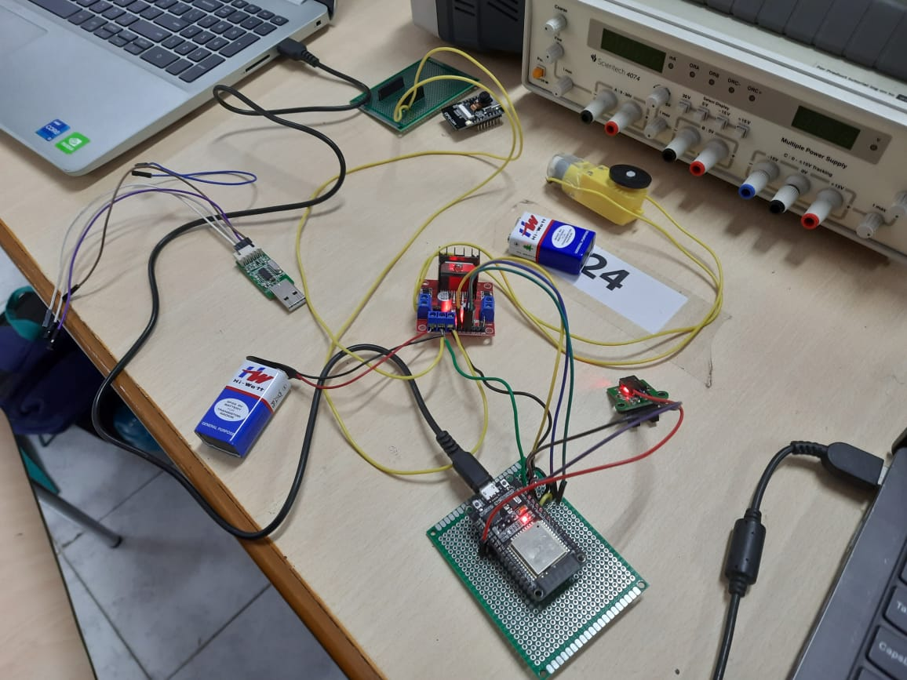

# Remote Labs - DC Motor

##  virtual environment where students can conduct hands-on experiments and practicals with    DC Motor
   - Remote labs are web-based platforms that enable users to remotely access and interact with real laboratory equipment and experiments from a distance. 
   - Dashboard gives real time readings of rpm vs current of DC motor.
----

### Team :
- Nikunj Garg 
- Manuj Garg 
- Ishit Bansal
- Pranav Gupta 

---- 

## Key Features

1. ### Register/ Login:
    - We have hosted our website globally on which new/existing users can register/login and start performing experiments listed.
    - We have Google Firebase for storing login credentials of the users.

2. ### Different Experiments page:
    - After logging in, a user can choose from different experiments shown along with the corresponding experiment theory.

3. ### Experiment Dashboard:
    - Steps for performing the experimenting are mentioned on the dashboard.
    - A 10 minute session timer is there in the dashboard, after which the user will automatically get logged out.
    - Two or more users cannot use the hardware setup for the same experiment.
    - The user can give the voltage input for the dc motor by a slider.
    - The resulting rpm value and graph between voltage and rpm will be plotted.
    - A user can watch the live stream locally.

